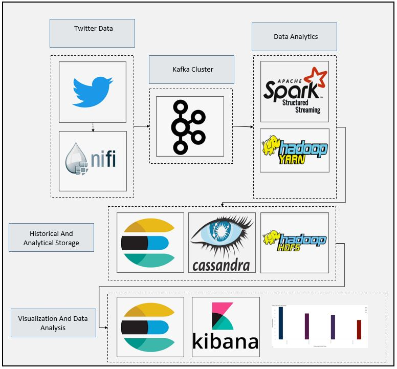
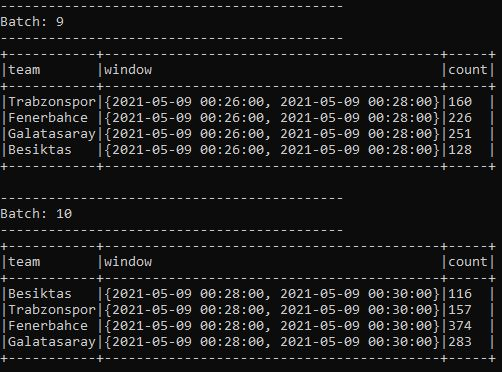
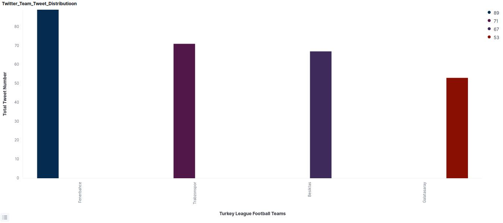

# SparkStream Football Team Tweet Count Analysis and Storage
### Dataflow Pipeline


### Summary

In this application turkish super league football teams tweets collected by nifi as a source data. Source data published continuously to kafka topic. Kafka topic consumed using Pyspark api and several dataframe structured to store them into hdfs, elasticsearch and cassandra databases. Kibana used to visualize data from elasticsearch index and apache cassandra used to store 6 months data as cold data. Historical data stored into hdfs as parquet format. This is very good application to see how you can connect your spark application with several storage system and how you can structure your data using spark structural streaming api.

### Task List

- [x] Create nifi pipeline
- [x] Create kafka topic
- [x] Create cassandra table
```
CREATE KEYSPACE twitter WITH replication = {'class': 'SimpleStrategy', 'replication_factor' : 1};

CREATE TABLE tweet_club (id TEXT PRIMARY KEY, team TEXT, count INT, start TIMESTAMP, end TIMESTAMP);
```
- [x] Create folder inside of the hdfs
```
hdfs dfs -mkdir /tmp/data/twitter
```
- [x] Create hdfs folder for historical data
```
hdfs dfs -mkdir -p /tmp/data
```
- [x] Check your hdfs port for spark code
```
hdfs getconf -confKey fs.defaultFS
```
- [x] Create spark code and define kafka, cassandra connection details
```
# Kafka Broker/Cluster Details
KAFKA_TOPIC_NAME_CONS = "twittercounter"
KAFKA_TOPIC2_NAME_CONS = "twittercounter2"
KAFKA_BOOTSTRAP_SERVERS_CONS = 'localhost:9092'


# Cassandra Cluster Details
cassandra_connection_host = "localhost"
cassandra_connection_port = "9042"
cassandra_keyspace_name = "twitter"
cassandra_table_name = "tweet_club"
```
- [x] Create foreachBatch function to save batch data into cassandra
```
# Cassandra database save foreachBatch udf function
def save_to_cassandra_table(current_df, epoc_id):
    print("Inside save_to_cassandra_table function")
    print("Printing epoc_id: ")
    print(epoc_id)

    current_df \
    .write \
    .format("org.apache.spark.sql.cassandra") \
    .mode("append") \
    .option("spark.cassandra.connection.host", cassandra_connection_host) \
    .option("spark.cassandra.connection.port", cassandra_connection_port) \
    .option("keyspace", cassandra_keyspace_name) \
    .option("table", cassandra_table_name) \
    .save()
    print("Exit out of save_to_cassandra_table function")
```

- [x] Start spark session and set timeParserPolicy as Legacy and define schema
```
#Create Spark Session to Connect Spark Cluster
spark = SparkSession \
        .builder \
        .master("local[*]") \
        .appName("TwitterFollowerCount") \
        .config("spark.streaming.stopGracefullyOnShutdown", "true") \
        .getOrCreate()

#Preparing schema for tweets
schema = StructType([
    StructField("timestamp_ms", StringType()),
    StructField("text", StringType()),
    StructField("user", StructType([
        StructField("id", LongType()),
        StructField("followers_count", IntegerType()),
        StructField("friends_count", IntegerType()),
        StructField("statuses_count", IntegerType())]))
])

# Setting timeParserPolicy as Legacy to get previous version timeparse behaviour
spark.conf.set("spark.sql.legacy.timeParserPolicy", "LEGACY")
# Setting log level to error
spark.sparkContext.setLogLevel("ERROR")

```
- [x] Define user defined function to extract team name information from tweets
```
def getTeamTag(text):
    if "Fenerbahce" in text or "Fenerbahçe" in text:
        result = "Fenerbahce"
    elif "Galatasaray" in text:
        result = "Galatasaray"
    elif "Besiktas" in text or "Beşiktaş" in text:
        result = "Besiktas"
    else:
        result = "Trabzonspor"
    return result

udfgetTeamTag = udf(lambda tag: getTeamTag(tag), StringType())

```
- [x] Convert string timestamp data to long type.
```
explode_df = explode_df.withColumn("timestamp_ms", col("timestamp_ms").cast(LongType()))

```
- [x] Write raw data into HDFS
```
# Write raw data into HDFS
explode_df.writeStream \
  .trigger(processingTime='2 minutes') \
  .format("parquet") \
  .option("path", "hdfs://localhost:9000/tmp/data/twitter") \
  .option("checkpointLocation", "/home/enes/Applications/data2") \
  .start()

```
- [x] Write data into hdfs
```
# Write raw data into HDFS
    transaction_detail_df_7.writeStream \
      .trigger(processingTime='5 seconds') \
      .format("json") \
      .option("path", "hdfs://localhost:9000/tmp/data") \
      .option("checkpointLocation", "/home/enes/Applications/data") \
      .start()
```
- [x] Define dataframe structure and generate timestamp type
```
df = explode_df.select(
    from_unixtime(col("timestamp_ms")/1000,"yyyy-MM-dd HH:mm:ss").alias("timestamp"),
    col("text"),
    col("id"),
    col("followers_count"),
    col("friends_count").alias("followed_count"),
    col("statuses_count").alias("tweet_count"),
    udfgetTeamTag(col("text")).alias("team")
)

df = df.select("*").withColumn("timestamp", to_timestamp(col("timestamp")))

```
- [x] Create 2 minutes window
```
# Create 2 minutes thumbling window
window_count_df = df \
    .withWatermark("timestamp", "10 seconds") \
    .groupBy(col("team"),
        window(col("timestamp"),"2 minutes")) \
        .agg(count("team").alias("count"))
```
- [x] Generate primary key for cassandra table
```
# Create unique primary key for cassandra table
window_count_df2 = window_count_df.withColumn("start", expr("window.start"))
window_count_df3 = window_count_df2.withColumn("end", expr("window.end")).drop("window")
window_count_df4 = window_count_df3.withColumn("id", concat(col("team"),col("start")))
```
- [x] Write data into cassandra table
```
# Save data to cassandra
window_count_df4 \
    .writeStream \
    .trigger(processingTime='2 minutes') \
    .outputMode("update") \
    .foreachBatch(save_to_cassandra_table) \
    .start()
```
- [x] Create kafka data and write data into kafka sink
```
kafka_df = window_count_df4.select("*")

kafka_target_df = kafka_df.selectExpr("id as key",
                                             "to_json(struct(*)) as value")

nifi_query = kafka_target_df \
        .writeStream \
        .queryName("Notification Writer") \
        .format("kafka") \
        .option("kafka.bootstrap.servers", "localhost:9092") \
        .option("topic", KAFKA_TOPIC2_NAME_CONS) \
        .outputMode("append") \
        .option("checkpointLocation", "chk-point-dir") \
        .start()
```
- [x] Write data on the console for debug purposes
```
console_query = window_count_df3 \
    .writeStream \
    .queryName("Console Query") \
    .format("console") \
    .option("truncate", "false") \
    .outputMode("append") \
    .trigger(processingTime="2 minutes") \
    .start()

console_query.awaitTermination()
```



- [] Create nifi pipeline to consume kafka data
- [] Put data into elasticsearch
- [x] Check visualization from kibana



### Code Description

spark_kafka_nifi_twitter_follower_counter.py is spark streaming code for data ingestion, storage, processing

### Running

1. Start zookeeper (Check kafka scripts)

```
zookeeper-server-start.bat config\zookeeper.properties (zookeeper-server-start.sh for linux)
```

2. Start kafka (Check kafka scripts)
```
kafka-server-start.bat config\server.properties  (kafka-server-start.sh for linux)
```

3. Start databases hdfs and yarn

```
sudo systemctl start mongod
sudo systemctl start cassandra
start-dfs.sh
start-yarn.sh
```

4. Start nifi and processors

5. Execute below code

```
spark-submit --master yarn --packages org.apache.spark:spark-sql-kafka-0-10_2.12:3.0.1,com.datastax.spark:spark-cassandra-connector_2.12:3.0.1 spark_kafka_nifi_twitter_follower_counter.py

```
6. Create cassandra keyspace and table

7. Create elasticsearch index

8. Check results
